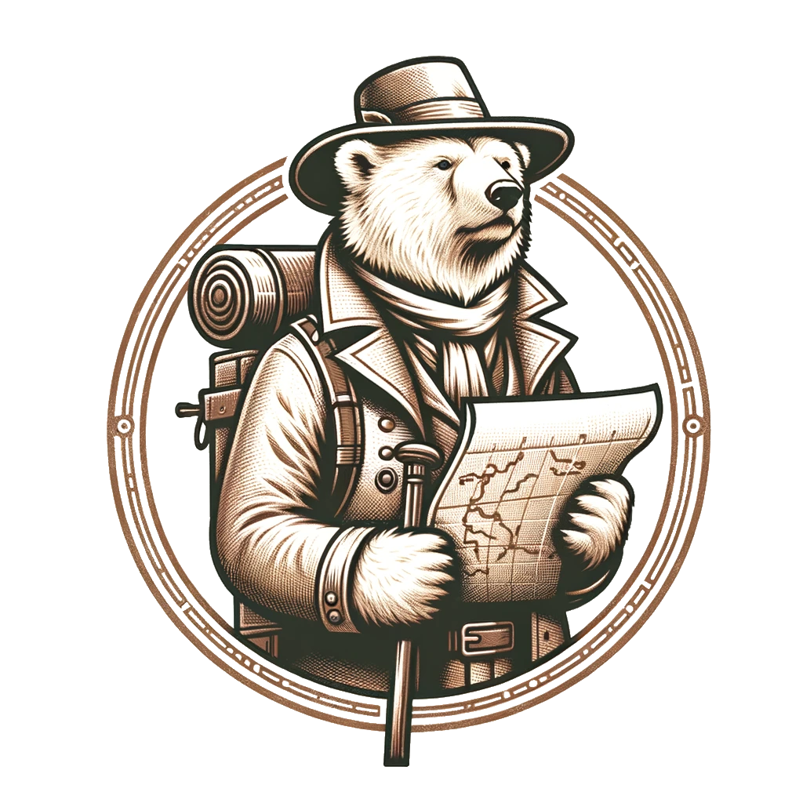

# Polars Expedition

Some experiments with [Polars](https://pola.rs) for the [Nuremberg Data Science & Artificial Intelligence #14 Meetup](https://www.meetup.com/nuernberg-data-science/events/299637415/).

[📜 Slide Deck](./var/20240321-14_Nuremberg_Datascience_AI_Meetup-Polars.pdf)

## Py Extension
`./polars-py-extension` contains a [PyO3](https://github.com/PyO3/pyo3) extension for Polars to encrypt and decrypt a column.

## WASM
`./polars-wasm` contains a [WebAssembly](https://webassembly.org/) module to get some stats of a CSV.